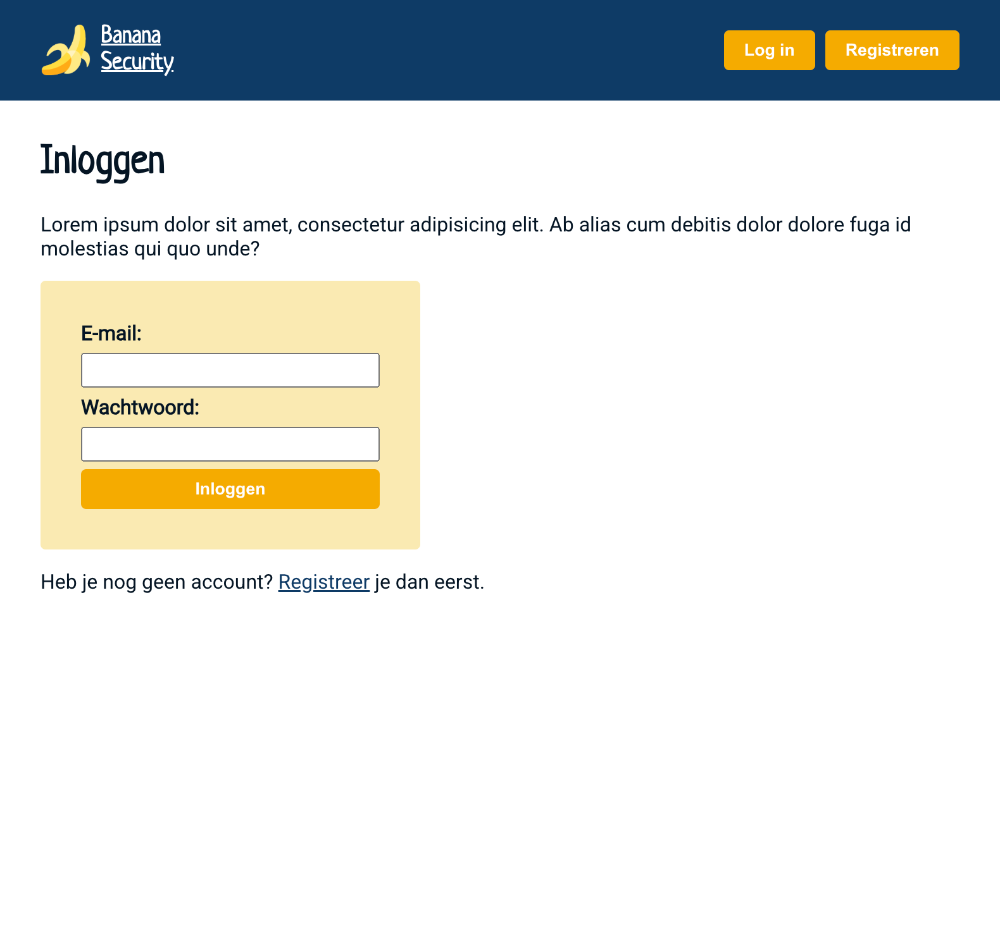
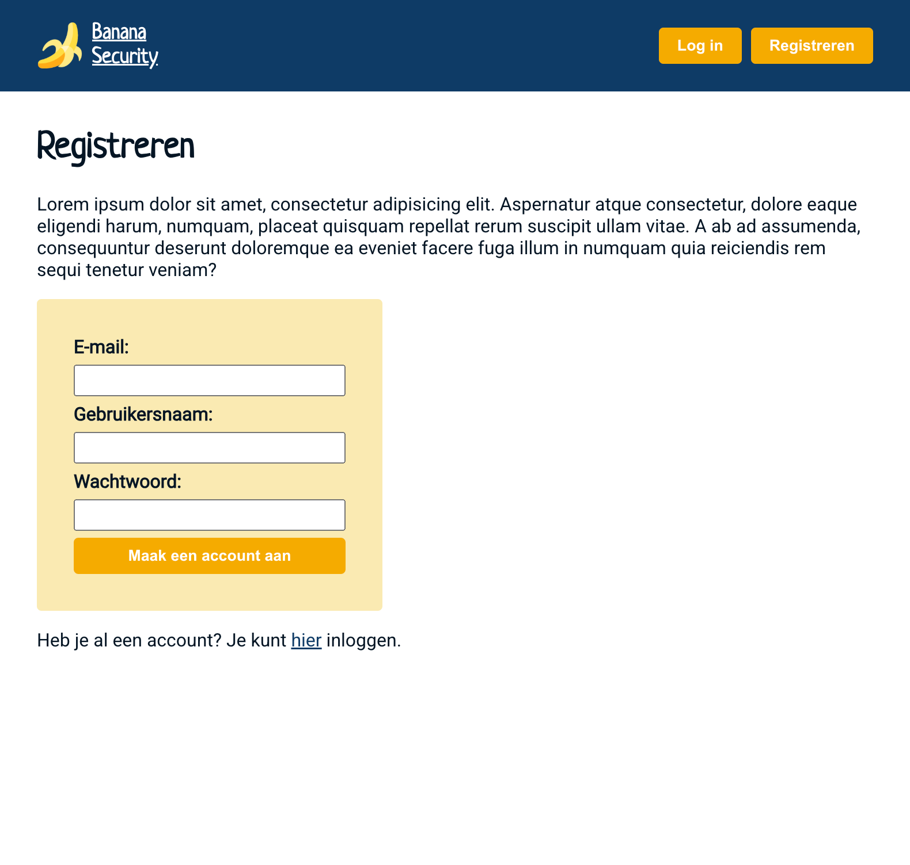
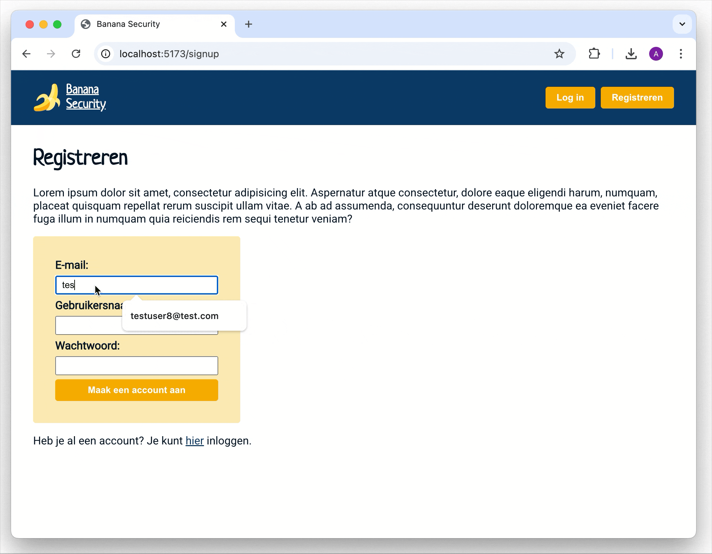

# 🔐🍌 Banana Security: Authentication App – NOVI Frontend Module

This repository contains my solution for the **Banana Security Authentication Application** assignment from the Frontend Development module at [Novi University](https://www.novi.nl).  
The goal of this project is to practice **React Context**, **state management**, **React Router**, and **protected routes** by building a secure platform where users can register, sign in, and access a protected profile page.

---

## Table of Contents

- [Tech Stack](#tech-stack)
- [Key Features](#key-features)
- [Preview](#preview)
- [Project Setup](#project-setup)
- [Credits](#credits)
- [License](#license)

---

## Tech Stack

- **React** (v18.2.0)
- **Vite**
- **React Router**
- **Axios** (for API requests)
- **Jwt Decode**
- **HTML5**
- **CSS3**
- **JavaScript ES6+**
- **Node.js** & **NPM**

---

## Key Features

### 📍 Routing & Navigation
- Four main pages:
    1. **Home** (`/`)
    2. **Profile** (`/profile`) – protected route, only accessible when logged in
    3. **Sign In** (`/signin`)
    4. **Sign Up** (`/signup`)

- **Navigation bar** that dynamically updates:
    - Shows **Login** and **Register** when logged out.
    - Shows **Logout** when logged in.

### 🔑 Authentication Flow
- Authentication state is managed globally with **React Context**.
- `login` function:
    - Updates auth state to `true`.
    - Redirects the user to the **Profile page**.
- `logout` function:
    - Updates auth state to `false`.
    - Redirects the user to the **Home page**.

### 👤 Profile Page
- Accessible only when logged in.
- Redirects unauthenticated users to the **Sign In** page.

### ✍️ Sign In
- Provides a controlled form with **email** and **password** fields.
- On successful login, the authentication context is updated and the user is redirected to the **Profile page**.
- Invalid access attempts to the Profile page redirect here.

### 🆕 Sign Up
- Provides a controlled form with **username**, **email**, and **password** fields.
- After submitting, the authentication context is updated and the user is redirected to the **Sign In Page**.
- Serves as an entry point for new users to register an account.

---

## Preview

<details>
<summary><strong>Home</strong></summary>  

 
</details>  

<details>
<summary><strong>Sign In</strong></summary>  


</details>  

<details>
<summary><strong>Sign Up</strong></summary>  


</details>  

<details>
<summary><strong>Profile</strong></summary>  


</details>  



> This demo shows the process of registration and log in. 


---

## Project Setup

1. Clone or open the repository & the server repository (git@github.com:AnneKluytmans/novi-frontend-react-banana-security-server.git) in an IDE

2. Install dependencies in both projects
   ```bash
   npm install
   ```
3. Start the development server
    ```bash
    npm run json:server
    ```
4. Run the application with
   ```bash
   npm run dev
   ```
5. Open your browser at http://localhost:5173 to view the app.


## Credits

> This assignment, visual designs and base project setup were created and provided by **Novi University** as part of the Frontend module.

---

## License

> "This project is for **educational purposes only**. All images, designs, and dummy content are to be used for learning and non-commercial use."

---